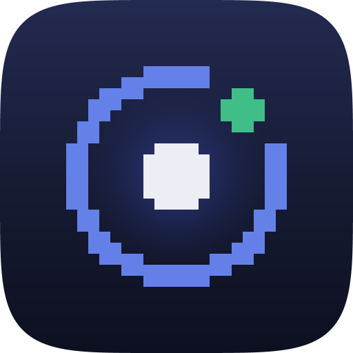

<div align="center">



# Gather Companion

**Know when someone starts following you in your live Gather V2 session.**

[](https://www.npmjs.com/package/gather-app-bridge)
[](LICENSE)
[](package.json)
[](bridge/)

*Not affiliated with Gather.* A third-party companion that connects to Gather V2
with your own session, from your own computer, and tells your phone what it sees.

</div>

---

## 🧭 How the pieces fit

| | what it is | where it runs |
|---|---|---|
| 📱 `lib/`, `ios/` | **Gather Companion** — a Flutter app that connects to Gather itself and shows who is following you, who waved, and what happened | your **phone** |
| 📦 `packages/gather_client/` | Gather V2's protocol in pure Dart: msgpack, the game socket, the presence fold | inside the **app** |
| 🖥️ `bridge/` | `npx gather-app-bridge` — a zero-dependency daemon that pairs your phone and wakes it while the app is closed | your **computer** |

**The phone talks to Gather directly.** Pairing hands it your Gather session, and
from then on it holds its own authenticated socket to the game server — so
presence works on cellular, with your computer asleep or shut.

The bridge is left with the two jobs a phone cannot do for itself: handing over
that session once, and noticing things while the app is not running so it can
push them.

```
                    ┌─────────────────────────┐
                    │   Gather's own servers  │
                    └────┬───────────────┬────┘
      authenticated      │               │      authenticated
      game socket        ▼               ▼    observer socket
       ┌─────────────────────────┐   ┌─────────────────────────┐
       │    Gather Companion     │   │    gather-app-bridge    │
       │       ← your phone      │   │      ← your computer    │
       │                         │   │          :7799          │
       │  follows · waves · chat │   │  watches while the app  │
       │  meetings · party mode  │   │  is closed, and pushes  │
       └─────────────────────────┘   └────────────┬────────────┘
                    ▲                             │
                    │                             │
                    │  1. pairing, once:          │
                    │     your Gather session ────┘
                    │
                    └──── 2. push, via FCM, when the app is asleep
```

The two connections do not fight: `Connection` is per-connection but `SpaceUser`
is per-person-per-space, so your phone, the bridge and the desktop client all
drive the same avatar without disturbing each other — measured, not assumed.

They differ in what they do once connected. **The bridge only ever reads**: it
never sends `enterSpace`, so it never appears in the room. **The app enters**,
because it is on its way to carrying a real call, and something that publishes
audio and video is present whether or not it admits it.

---

## 🚀 Quick start

**1.** On the computer that has Gather open:

```sh
npx gather-app-bridge
```

That installs it as a background service — starts at login, restarts if it dies,
survives sleep.

**2.** Let it into Gather. **Do this before pairing** — pairing is what hands the
session to your phone, so a phone paired first gets nothing to connect with and
has to be paired again:

```sh
npx gather-app-bridge adopt
npx gather-app-bridge restart
```

This reuses the Gather session your desktop app is already signed in with. No
login, no second account, nothing visible to your colleagues. See
[How it connects](#-how-it-connects).

**3.** Pair your phone:

```sh
npx gather-app-bridge pair
```

It draws a QR square in the terminal. Scan it in the app and you are done; the
code and address are printed underneath for a phone whose camera is refused.

Two things cross at this moment: a token scoped to this bridge on this LAN, which
is only used to tell it where to send pushes, and **your Gather session**, which
is what lets the phone read presence on its own afterwards. The app puts the
second in the iOS keychain. If the bridge has no session yet, the app says so
rather than pairing into a feed that can never fill.

**4.** Check what it can actually see:

```sh
npx gather-app-bridge doctor
```

---

## 🛰️ How it connects

```sh
npx gather-app-bridge adopt
npx gather-app-bridge restart
```

`adopt` copies the Gather session the desktop app is *already signed in with* —
Firebase keeps it in the renderer's IndexedDB — into the bridge's own config. There
is no login to perform and no second account to create. Refresh tokens are
long-lived, so this is a one-time read: afterwards the bridge mints its own ID
tokens and never touches the desktop client again.

It then opens its own game socket in **observer mode**, and hands the same session
to your phone at pairing so the app can open one too. Gather splits joining a
space into two actions: `loadSpaceUser` starts the state dump, and `enterSpace`
puts an avatar in the room. Sending only the first is enough to receive the entire
roster — names, `followTargetId`, live voice activity, `clusterId`, and tile
coordinates for party mode.

**The bridge stops there** and stays invisible, with `Connection.entered: false`.
**The app goes on to send `enterSpace`**, and follows it with `reportActivity` so
it does not sit in the room looking idle. That is the honest position for a client
heading towards two-way audio and video: you cannot be in a call and not be in the
room. It costs one thing worth knowing — `numTimesEnteredSpace` is a permanent
counter on your own profile and increments once per entering connection.

None of these connections disturbs the others, which was the long-standing fear:
Gather's gateway was believed to evict a duplicate `spaceId` + `authUserId` with
close code 4031. Measured on 2026-08-06 against a live 111-person space, with the
desktop client joined and watched throughout: the client's socket was never closed
and never dropped a frame. The structural reason is that `Connection` is
per-connection while `SpaceUser` is per-person-per-space — so the phone, the
bridge and the desktop client are all looking at, and for party mode moving, the
same single avatar. There is no second you to collide with.

And because the full state dump is sent once per *connection*, and the connection
is ours, `resync` is just a reconnect.

Protocol details, the REST surface, and what is still unverified:
[`docs/gather-api.md`](docs/gather-api.md).

**What you get:**

- 🎯 **who is following you**, read from the field that actually means it, not
  guessed from movement. Reported as `confidence: "observed"`.
- 🏷️ display names
- 🔊 **which of your followers is talking** — `SpaceUser.speaking`, which on a
  live 111-person space was the most frequent update of any kind
- ✋ **waves, with the name of whoever sent one** — off Gather's own event bus
- 📅 **meeting invites**, and **somebody knocking on a meeting** you are in
- 💬 chat messages

**What this deliberately does not do:** ❌ tell you who is standing next to you.
It used to. Being near somebody says nothing about whether they want you — people
park at desks, walk past on the way somewhere else, and loiter at the edge of the
radius — and it produced most of the events and the least of the meaning.
Somebody *following* you is a decision they made about you, which is the only
thing worth a notification.

**What nothing can give you:** ❌ mic, camera and screenshare state. Those were
IPC state inside the desktop client and appear in no Gather model, no REST route
and no delta patch. `speaking` is the honest replacement — it says who is
*talking*, which is what you wanted to know anyway.

### 📄 What comes from where

| | source | needs the desktop app? |
|---|---|---|
| Someone following you, and whether they are talking | game socket, state | no |
| Names, space name | game socket, state | no |
| Wave (with a sender), chat | game socket, **event bus** | no |
| Meeting invite, somebody knocking on a meeting | game socket, state | no |
| Event reminder | `main.log` | **yes** |
| Mic / camera / screenshare | — | not available at all |

Almost none of this needed the desktop client, and for a long time we thought
most of it did. `DeltaState` carries a third array beside `patches` — `events[]`,
a genuine event bus — and the reader was throwing those frames away as
unrecognised because their `patches` array is empty. Every wave had been arriving
on the socket all along. See [`docs/gather-api.md`](docs/gather-api.md) for the
measurement and the reasoning that got it wrong.

An event reminder is the last thing still scraped, and only because nobody has
implemented it from `BaseCombinedCalendarEvent.startDateTime` yet — which is
where Gather's own client gets it.

One nicety survives from the scraping era: Gather suppresses its own notification
when its window has focus, and this does not. Looking at Gather on your Mac is no
reason to withhold a wave from the screen in your pocket.

---

## 🔔 Notifications, and reaching a phone that is asleep

There are two delivery paths and they cover different moments.

**Local notifications** fire from the app itself, and only while it is running —
in the foreground, or during the short window iOS grants a backgrounded app
before it suspends its Gather socket. After that the socket is gone.

**Push** is what survives that, and it is the reason the bridge still exists. It
holds its own connection to Gather precisely so that something is awake when your
phone is not, and sends through Firebase Cloud Messaging:

| reason | on by default | why |
|---|---|---|
| wave | ✅ | rare, deliberate, always means somebody wants you |
| someone follows you | ✅ | rare and unambiguous |
| meeting invite | ✅ | scheduled and time-bound |
| someone knocking on your meeting | ✅ | the only one with a deadline — measured gap between the knock and the answer was two seconds |
| event reminder | ✅ | scheduled and time-bound |

All of them are deliberate acts by a person, which is the whole bar — and why
there is almost no rate limiting. The exception is the wave *button*, which is
debounced per sender: one person produced **41 waves in eight seconds** while this
was being measured. Any reason can be switched off per install with
`push.kinds.<reason>: false` in `~/.gather-app-bridge.json`.

No double-ups: iOS does not display a push while the app is frontmost unless the
app asks it to, and this one does not. So the local notification is what you see
when the app is open, and the push is the only one when it is not.

### The computer has to be running

Worth saying outright, because the diagram above implies it and the prose used to
leave it to be inferred: **the bridge is the thing that sends the push.** There is
no cloud service in this project. FCM removed the need for the phone to hold a
live socket, not the need for the computer — something has to be awake to notice
the wave, and that something is the daemon on your Mac.

What it does *not* need is the phone and the computer being on the same network at
the time. The push goes bridge → FCM → APNs → phone, so the phone can be anywhere.
The LAN is needed once, to hand the token over.

The settings screen says which of those is true, and it now says it from the result
of an actual attempt. It used to render "is a host and token stored", printed under
the word *Unreachable* — so it called a sleeping Mac reachable forever, and called a
phone that had no bridge address at all unreachable, which sends you to inspect a
computer that is fine. Six states, because six different things go wrong in six
different places:

| the card says | what is actually wrong | where to fix it |
|---|---|---|
| Can wake this app | nothing | — |
| Can't reach it right now | the Mac is asleep, off, or elsewhere | nothing to do; pushes resume |
| No push credentials yet | the daemon has no FCM service account | `gather-app-bridge push setup` |
| No computer paired | the phone has no bridge address — **an app reinstall does this** | pair again |
| iOS has not issued a push token | a simulator, or a build without the entitlement | run on a device, check `aps-environment` |
| Notifications turned off | permission refused | iOS Settings |

> [!WARNING]
> **A reinstall used to break push silently, and that is the failure to know about.**
> iOS wipes an app's preferences on reinstall but leaves its keychain alone. The
> Gather session lived in the keychain and the bridge address did not, so a reinstall
> left the phone connected to Gather — presence, map and feed all working — with no
> bridge address, and registration bails without one. The phone stopped handing over
> its token, the bridge went on pushing to the token from the *previous* install, FCM
> answered `200`, and nothing arrived. Both halves now live in the keychain and move
> together, and the daemon keys its device list on a stable install id rather than on
> the token, so a reinstalled app replaces its old entry instead of leaving it there
> absorbing pushes. A device that has neither re-registered nor been reached in 60
> days is dropped — `push.staleAfterDays` in `~/.gather-app-bridge.json` to change it.

### Setting it up

Push is optional. Everything else works without it; you simply do not get woken
when the app is closed.

**1. An APNs key from Apple.** Developer portal → Certificates, Identifiers &
Profiles → **Keys** → new key → tick *Apple Push Notifications service (APNs)*.
Download the `.p8` — Apple lets you do that exactly once — and note the Key ID.
This is **not** the App Store Connect API key used to upload builds; different
section, different key.

**2. Enable the capability on the App ID**, then **regenerate the
`Gather Companion App Store` provisioning profile**. This is the step that bites:
signing here is manual (see `ios/ExportOptions.plist`), so an existing profile
without the push entitlement fails the build rather than quietly updating itself.

**3. Give the key to Firebase.** Console → Project settings → **Cloud Messaging**
→ APNs Authentication Key → upload the `.p8` with its Key ID and team `JQ4STVWTQ3`.

**4. Give the bridge a service account.** Console → Project settings → **Service
accounts** → *Generate new private key* → a JSON download. Then:

```sh
npx gather-app-bridge push setup ~/Downloads/gather-companion-....json
npx gather-app-bridge restart
```

That validates the file, copies it to `~/.gather-app-bridge-fcm.json` and chmods
it `0600`. Open the app once so the phone registers, then:

```sh
npx gather-app-bridge push test
```

> [!WARNING]
> **`aps-environment` is the classic silent failure.** A build signed for
> development gets a *sandbox* device token, and the production APNs gateway does
> not know it — the phone registers, the bridge sends, FCM answers `200`, and
> nothing arrives, with no error anywhere. That is why there are two entitlements
> files (`Runner.entitlements`, `RunnerRelease.entitlements`) wired per build
> configuration rather than one file Xcode rewrites, which it only does under
> automatic signing.

---

## 🪩 Party mode

The one control in the app, and the only thing in this project that *writes* to
Gather. Switch it on and the bridge teleports your avatar to a random tile four
times a second until you switch it off.

Two things make that less trivial than picking coordinates.

**Gather's server does not check walkability.** Every tile on the grid is
accepted — walls, scenery, the void outside the map. Collision is enforced
client-side only, so uniform random coordinates put you inside furniture about as
often as not.

So party mode reads the actual floor plan. **Gather sends the whole map in every
state dump** — `MapArea` rectangles, 1140 `MapObject`s and the
`CatalogItemVariant.collision` shapes behind them — and this client used to throw all
of it away. There is no REST route for any of it; `/spaces/<id>/maps`, `/floors` and
`/map` all 404. It was only ever on the socket.

The decoding is **transcribed from Gather's own client**, not inferred. The first
attempt did infer it — sweeping every plausible rounding against the live roster and
keeping whichever put nobody inside a wall — and produced a confident answer that was
wrong in 425 of about 500 tiles. Eleven people were connected at the time, and four
contradictory rules all scored zero. So the rules now come from the web bundle
(`bundle.fcbc27cfb33c44ea.js`, class `Collisions`), down to backing the sprite's pixel
origin out before rounding, skipping objects that sit on other objects, and knowing
that **walls block movement between tiles rather than the tiles themselves** — so a
wall is standable, and 488 tiles the first version excluded are fine. Result:
**9705 walkable tiles of 10168**, updated live as people rearrange the furniture.

It used to guess instead, and that was the whole of the "party mode keeps revisiting
the same tiles" bug. The old rule was *a tile somebody has been seen on is a tile you
can stand on* — true, and nowhere near enough. Most members are parked at a desk, so
a state dump was worth about one tile per member: **78 tiles of a 124×82 map**, under
one percent of the floor, and after the safety radius **eighteen** were left. Four
hops a second exhausts eighteen tiles in five seconds. The picker was never at fault
— it was already visiting everything it was offered.

**Landing next to someone opens the video bubble on their screen.** Doing that
four times a second, to a different colleague each time, would be a genuinely
antisocial thing to inflict on an office. So every candidate tile is held at
least **5 tiles** from everyone currently connected — two clear of the 3 tiles at
which Gather connects media, with the margin covering the fact that the roster is
always a beat behind. It was 8, which bought margin nobody can perceive at the
price of a third of the usable floor. Offline rows cost nothing: somebody who logged
off at a desk is not standing there.

**Walkable is not the same as somewhere to hold a party**, and the difference was
most of the map. Two manners rules narrow it, kept as separate lists from the
collision one so the physics and the etiquette never get confused.

The first is that a party stays *inside the office*. Walls block directions rather
than tiles, which is what keeps a walking avatar indoors — and a teleport has no
direction to block. Nobody furnishes the emptiness outside the building, so no
collision rule can object to it, and since hops are chosen for distance it is
exactly where they went: **5133 of 7315 candidate tiles were outside the building
altogether**. The base area is the whole grid and proves nothing; the other 92 areas
are the office, and a tile has to be in one of them.

The second is that it stays out of rooms with doors. This used to follow Gather's own
`get isPrivate(){ return this.isWalled }`, which is right about audio and wrong about
buildings: the main floor is itself a walled 44×34 `Public` area and the Lobby is
walled too, so "walled means private" deleted the entire office — **all 112 people in
the captured dump were standing on tiles it excluded**. Walls only close a room when
the area is a `MeetingRoom` or a private desk booth.

Together: **1447 tiles**, all indoors, and 94 of those 112 people were standing in
them.

When nothing clears, the hop is **skipped** rather than approximated, and the
card says why. A party that pauses is a smaller problem than a party that walks
into someone.

Measured live against a 111-person space: 16 hops in 4 seconds, closest approach
8.1 tiles.

It ends on its own after **15 minutes**, and it runs *in the app*, against the
socket the app already holds — so a tap is instantly true, with no round trip to
the computer to be optimistic about. It also dies with the app, which the older
bridge-side version did not: that one would happily keep hopping for the rest of
the quarter-hour after your phone went flat.

Entering the space is **not** required to move — `SpaceUser` is
per-person-per-space, so even an observer connection drives the same avatar the
desktop client draws. Party mode was built on that and does not depend on the
app now entering. What entering does cost is `numTimesEnteredSpace`, the one
counter that cannot be undone; it goes up once per entering connection, which is
why the app declines to reconnect a socket that is already healthy. See
[`docs/gather-api.md`](docs/gather-api.md).

---

## 🔬 How it reads the protocol

The bridge holds one binary WebSocket to
`wss://game-router.v2.gather.town/gather-game-v2`, decodes the msgpack, and
interprets the model deltas.

It used to read those same frames sideways, off the desktop client's devtools
port, because there was no other way in. There is now, and it is better in every
respect: no debug port left open on a live session, no dependency on the client
running, and a fresh state dump on every connect.

The handshake, in order — captured from the desktop client's *own* outbound
frames, so these shapes are observed rather than guessed:

```
Authenticate → ConnectToSpace → Subscribe → SpaceStatus
→ FullStateChunk ×N   (the initial dump, ~1500 patches per chunk, ~45 models)
→ DeltaState, Action  (everything after)
→ Heartbeat           (~1/s, and the bulk of the traffic)
```

State arrives as patches against model rows. They are *not* JSON-Patch — there
are exactly three ops:

```js
{ op: 'addmodel',    model: 'SpaceUser', data: {...} }              // whole row; id is inside data
{ op: 'deletemodel', model: 'SpaceUser', id: '<id>' }               // row removed
{ op: 'replace',     model: 'SpaceUser', id, path, data }           // one field
```

- 🎯 **following** — a `replace` on *their* row's `/followTargetId` set to *my*
  id. There is no "follow started" server event; the official client derives it
  the same way (`SpaceUser.followers` filters by `followTargetId === this.id`).
  `followTargetId` is an optional column, so it is *absent* rather than null when
  unset — and the bridge tells the two apart, because absent means "this space
  never said" while null means "nobody".
- 📐 **position** — still decoded, but no longer to judge who is near whom. It is
  where party mode measures its clearance from, and where the map screen draws
  people. Position mutates
  component-wise, so walking arrives as `/position/x` and `/position/y`; a
  teleport replaces `/position` wholesale with an ext-0 `Position` value object.
  Both shapes are handled.

Identity — which row is mine — comes from the `Connection` model, which carries
both halves:

```js
{ model: 'Connection', data: { authUserId: '<firebase uid>', spaceUserId: '<my SpaceUser id>' } }
```

The Firebase uid comes out of our own ID token, so no lookup is needed.
`UserAccount.firebaseAuthId` plus `SpaceUser.userAccountId` is a second route.

Bots and recording clients (`isBot`, `type: 'RecordingClient'`) are filtered out —
every real space has them and none of them is going to follow you.

### ❄️ Cold start, and `resync`

The full state dump is sent **once per connection** — which used to be a real
problem, because the connection belonged to somebody else. Attaching to a client
that had been running for days yielded heartbeats and nothing else until somebody
moved, and people who never moved stayed invisible; shaking the dump loose meant
reloading the Gather renderer.

The connection is ours now, so every connect is a fresh dump and `resync` is
simply a reconnect. The bridge still refuses to report itself healthy while it
holds no state — an empty roster presented confidently would let the app say
"nobody is following you" out of nothing.

---

## ⌨️ Commands

```
npx gather-app-bridge                install as a background service and pair
npx gather-app-bridge run            run in the foreground instead
npx gather-app-bridge status         is it alive, and who is around right now
npx gather-app-bridge pair           show a QR square for the phone to scan
npx gather-app-bridge adopt          reuse your Gather session (required, once)
npx gather-app-bridge doctor         what can it see, and how to see more
npx gather-app-bridge resync         force a full state resync
npx gather-app-bridge logs -f        follow the daemon log
npx gather-app-bridge token          show the pairing details again
npx gather-app-bridge restart|stop|start|uninstall
npx gather-app-bridge replay [file]  re-check the notification regex on a log
npx gather-app-bridge push           is push set up, and who is registered
npx gather-app-bridge push setup <f> install the Firebase service account JSON
npx gather-app-bridge push test      send a test notification to every phone
```

**Options:** `--port <n>` (default `7799`), `--token <s>`, `--log-file <path>`,
`--space <uuid>` (watch a specific space, rather than the last one you opened).

### 👁️ Watching the stream from a terminal

You do not need the phone to see what the bridge is doing:

```sh
npx gather-app-bridge watch                        # attach to the live feed
npx gather-app-bridge watch --history 20           # last 20 events, then follow
npx gather-app-bridge watch --filter follow,notification
npx gather-app-bridge watch --json | jq .          # one event per line, pipeable
npx gather-app-bridge watch --raw                  # everything, unfiltered
npx gather-app-bridge watch --host 192.168.1.20    # a bridge on another machine
```

It uses the same contract as the app — snapshot first, then live events, resuming
by sequence number after a dropped connection — so nothing is lost while it
reconnects.

**`--raw` matters, because the normal stream is not everything the bridge sees.**
Three layers sit between interception and publication:

| dropped where | what gets dropped |
|---|---|
| `PresenceTracker` | anything that is not a *state change*, and everything that is not about following: the whole space walking around, plus voice activity, which is recorded in state but never announced — `speaking` toggles every few seconds while somebody talks |
| `GameProtocolReader` | 43 of ~47 models — calendar events, chat metadata, catalog items, map areas, GitHub PRs. Only `SpaceUser`, `Connection`, `UserAccount` and `Space` are kept |
| the collector | heartbeats, bots, recording clients |

That filtering is deliberate — a feed that announced every flicker of voice
activity would be useless — but it means the published stream understates what is
available. `--raw` subscribes to the firehose before the tracker sees it. Frames
marked `kind: "raw"` rather than `kind: "event"`.

For what is being decoded but *discarded entirely* (the other 43 models, frame
type counts), look at `stats` in `GET /collectors`.

### ♾️ Staying up

On macOS it installs as a `LaunchAgent` (`com.jonasgrunau.gather-app-bridge`) with
`RunAtLoad` and `KeepAlive`, so it starts at login and comes back if it crashes.
Two details that matter over months of uptime:

- 📦 The package is **copied into `~/.gather-app-bridge/bridge`** at install time.
  `npx` runs out of a cache npm may prune, and a global install disappears on the
  next `npm uninstall` — either would leave launchd pointing at nothing.
- 🔗 It resolves a **version-independent `node`** (`/opt/homebrew/bin/node` and
  friends) rather than `process.execPath`, which under nvm/asdf points at a
  version-pinned path that vanishes on the next Node upgrade.

Across a sleep the game socket reconnects with backoff — and gets a fresh state
dump for free — while the notification tailer re-stats the log file, because it
polls rather than trusting `fs.watch`, which stops delivering events after a
suspend without erroring.

**Reconnects in the log are normal.** Measured 2026-08-07→13: 387 drops, every
connection ending in one, median lifetime 10 minutes. Two causes, neither a fault:
Gather's gateway recycling connections (close **1012**), and this Mac suspending
(**1006** — 63% of drops landed within two minutes of a sleep or wake, against a 6%
baseline). Each one now names its cause in the log instead of repeating an
undifferentiated `game socket error`, which is what those 387 lines used to say.

The case that *was* worth fixing is the drop that never announces itself. A
suspend can leave a half-open TCP connection with no `close` frame ever arriving,
and since `close` is what drives every reconnect, the collector sat there reporting
a live roster while receiving nothing at all — the shape of "presence looks fine and
no notification ever comes". Both collectors now reconnect after 45 seconds of total
silence; Gather heartbeats every 3–9 seconds, so nothing that quiet is alive.

What no watchdog can fix is that a sleeping Mac sends no pushes, because nothing is
awake to notice the wave. That is inherent to a laptop being the sender.

---

## 📡 HTTP / WebSocket API

Everything except `/health` and `/pair/claim` needs `?token=<token>`.

The app uses exactly one of these — `POST /push/register` — on attach, on resume,
and whenever Firebase rotates its token. That one call is also how the app knows
whether the computer is reachable and able to send: it is idempotent by design and
its reply carries `sending`, so there is nothing to poll and no separate probe. The
rest are the operator surface that `gather-bridge watch`, `replay`, `resync` and
`doctor` are built on; they go dormant when nothing is attached.

| endpoint | what |
|---|---|
| `GET /health` | liveness, no token, nothing sensitive |
| `GET /state` | current snapshot: self, players, collector health |
| `GET /events?since=<seq>` | replay recent events |
| `GET /collectors` | what is connected, and why not |
| `WS /ws?since=<seq>` | snapshot frame, then live events |
| `WS /ws?raw=1` | additionally the unfiltered firehose, as `kind: "raw"` frames |
| `GET /resync` | force a full state resync (reconnects the game socket) |
| `POST /push/register` | phone hands over `{token, platform, installId}` (idempotent, keyed on `installId`); replies `{ok, devices, sending}` |
| `GET /pair/offer` | mint a pairing code (used by `pair`) |
| `GET /pair/claim?code=` | **no token** — trade a code for the bridge token *and your Gather session*, once |

Every event carries `type`, `at`, `source` (`gather` \| `log` \| `bridge`) and
`confidence` (`observed` \| `inferred`). Frames are
`{kind:'snapshot'|'event', seq, ...}`; reconnecting with `?since=<lastSeq>`
replays exactly what was missed, which is what keeps the phone's log complete
across screen locks.

**Event types:** `follow.started/stopped`, `self.changed`, `space.changed`,
`notification.shown`, `bridge.status`. The Dart package still decodes several
types the bridge no longer emits (`media.changed`, `player.joinedSpace/leftSpace`,
`chat.message`), so a phone can read an older bridge.

The Dart definitions in `packages/gather_events` are the same contract, so the
app decodes these into a sealed class hierarchy.

---

## 📱 The app — Gather Companion

The bridge is the computer half; Gather Companion is the phone half. It says so
wherever there is room to — in-app header, `MaterialApp.title`, permission copy —
because "Gather" alone would read as Gather's own client. The one exception is
the home-screen label, which the launcher clips to about ten characters:
"Gather Companion" came out as "GatherCom…", so the tile says **Gather** and the
app introduces itself properly once opened.

Nothing in `lib/` is platform-specific: it is plain Flutter over an HTTP and
WebSocket contract, so the same code targets phones and desktops. Only the iOS
runner is scaffolded so far — `flutter create --platforms=android,windows,linux .`
at the repository root adds the rest, and the icon generator needs a matching output path
per platform.

```sh
flutter run -d <device>
```

To sideload on iOS: open `ios/Runner.xcodeproj` in Xcode, set a signing team
on the `Runner` target, then `flutter run -d <device>`. A free Apple ID works for
personal device installs.

**Build notes worth knowing:**

- 📐 **iOS 15.5 minimum**, required by `mobile_scanner`. The same package needs
  Android 5.0 / API 21 and camera permission in the manifest.
- 📦 **Swift Package Manager, not CocoaPods** on the iOS side. `mobile_scanner`
  7.x is a Swift package, and leaving the old CocoaPods integration in place
  breaks the build with a misleading *"missing expected TARGET_BUILD_DIR"*. If you
  ever re-add a pod-based plugin, expect to sort that out. Version 7 also dropped
  GoogleMLKit, which had no arm64 simulator slices — on 6.x the app simply could
  not run on an arm64 simulator at all.
- 🖥️ **Desktop targets have no camera scanner.** `mobile_scanner` is mobile-only,
  so a desktop build has to fall back to the type-the-code path, which already
  exists and is a first-class route rather than a fallback.

While working on the feed,
`--dart-define=GATHER_PAIR=host:port:token:refreshToken` skips the scanner, which
a simulator or emulator has no camera for. It needs the Gather refresh token too,
since that is what the app actually connects with — read it out of
`~/.gather-app-bridge.json`:

```sh
flutter run -d <device> \
  --dart-define=GATHER_PAIR=127.0.0.1:7799:<token>:$(node -p \
    "require(require('os').homedir()+'/.gather-app-bridge.json').gather.refreshToken")
```

Your phone and computer have to be on the same network **to pair**, and for push
registration afterwards. Presence itself needs neither. Phone platforms ask for
local-network permission the first time, and for the camera the first time you
scan.

### 🔗 Pairing

Modelled on Superset's flow: scan the square, or type the eight characters. The
long token is never typed or shown — the QR carries a short code which the app
trades exactly once (`GET /pair/claim`). The code lives for fifteen minutes, only
after somebody ran `pair`, and a few wrong guesses destroy it.

What crosses at that moment got more valuable: it used to be a token scoped to
one daemon on one LAN, and it is now **your Gather identity**, because that is
what lets the phone read presence without the computer. The protections are
unchanged and still the right ones — no code exists until you run `pair`, single
use, fifteen minutes, eight wrong guesses and it is gone — but the stakes are
higher, and the app stores what it receives in the iOS keychain
(`first_unlock_this_device`) rather than in a preferences plist that device
backups would include.

The alphabet excludes `0`, `1`, `I`, `L` and `O`, so there is nothing to misread.
A character outside it is refused rather than guessed at — pairing on a
misread code would be worse than asking someone to look again.

### 🗺️ The map

The map icon in the header opens the office **in Gather's own artwork**: floors,
walls, doorways, every piece of furniture, and everybody in it drawn as their own
avatar, facing the way they are facing and sitting down when they are sitting down.
Pinch to zoom, double-tap to jump in and out, drag to pan — though never far enough
to drag the background in beside the office: zoomed out, the floor covers the screen,
and that is the floor.

Labels are Gather's own: a dark capsule above each head carrying the name and an
availability dot, yours in the accent colour, and the **team zones** named above
themselves. Nothing is drawn around a body — no ring, no halo. The meeting rooms are
deliberately not written across the floor: the office names twenty-eight areas and
writing all of them turned it into a contents page, while the one you are actually
standing in is already in the app bar. Zone names come off once they no longer fit;
names never do, because "where is everybody" is the question the screen is for.

**People walk.** Gather's positions are whole tiles — measured, all 98 rows of a live
dump carry integer coordinates — and the roster this app reads is coalesced at a
quarter of a second, so drawn literally the office is a room full of people
teleporting. So they are walked between the tiles instead, at Gather's own seven
tiles a second, linearly, and with its own rule that a jump of more than eight tiles
is a teleport rather than a sprint — which is what keeps a party-mode hop reading as a
hop. The legs move while they walk, they sit down on chairs, and their mouth moves
while they are speaking, all off the client's own animation table. Turn animations off
in your system settings and everybody stands on their tile, which is exactly what the
desktop client does with that setting.

**And you can walk.** A translucent pad sits across the bottom of the map: hold a
quarter to walk that way, roll your thumb to the next one to turn a corner without
stopping, slide back to the middle to stand still. It is one gesture rather than four
buttons for exactly that reason — four buttons make going round a corner a stutter,
because you have to lift, find the next one, and press again.

Getting that right needed two things Gather does not hand you. The first is that
**`move` checks nothing**: its entire body on the model is `position += delta`, so
whether a step is legal is decided on the client or nowhere, and a pad that sends
steps blind walks you through the desks and out into the void around the office. So
the wall rule was read out of the client bundle the same way the rest of the floor
plan was — walls are *lines between tiles*, not tiles, which is why you can stand on
one and why a doorway is a gap in a line rather than a hole in a wall.

The second is that **the wire is always two steps behind your thumb**. Positions are
coalesced at a quarter of a second and a walk runs at seven tiles a second, so a step
judged against the roster's idea of where you are is judged against where you were two
steps ago — into the first wall you meet. So the phone keeps its own count of which
tile you are on and lets the roster correct it: a position it never claimed to be
heading for wins outright, which is what makes it safe to drive one avatar from the
pad, the desktop client and party mode at the same time.

No arrow is ever greyed out. An earlier version dimmed the ones that led into a wall
and it read as a fault — the arrows flickered as you walked past doorways. You find a
wall the way you find one in any game: by walking into it and stopping.

**None of that art is bundled, and Gather ships no tileset.** The client resolves one
image per floor texture, per wall piece and per furniture variant and fetches each on
its own; so does this. On the space it was built against that is **573 images
totalling 222 KB** — pixel art at 32×32 is a few hundred bytes a file — which is why
downloading the whole office on a phone is a reasonable thing to do rather than an
extravagance. They are cached on disk, so the second visit costs nothing. Avatars
come from Gather's sprite service, which composites an outfit into one 72-frame
spritesheet; `docs/gather-api.md` has the URL rules, including the "hash" that is not
a hash.

The schematic it used to be is still underneath, and still does the work while the
art is in flight or when the network is not there at all.

**Who is drawn is a separate question from who is connected**, and getting it wrong
was visible: `SpaceUser.connected` goes stale when a socket dies without saying
goodbye. Measured against a real space, twelve rows claimed it and nine of them were
people who had gone home — so the map drew eleven bodies into an office holding
three. Presence is the pair: connected *and* `userSetAvailability` not `Offline`.
Availability alone is no better, because people close the app without touching it.

### 📋 What the main screen shows

Who is following you, which of them is talking, and whether the party is on. That
is the whole screen, and all of it is *now* — read from the live Gather socket, not
from history.

There used to be a scrolling activity feed underneath, kept by the app itself. It was
worth having when the bridge kept a 500-event ring on a computer that was awake all
day and replayed it on connect. Once the app talked to Gather itself, the log could
only record what happened while the app was open — the one window in which you were
already looking at the screen — so it was empty exactly when it would have been
useful. Everything worth interrupting you for arrives as a **push notification**
instead, which works whether the app is running or not.

What is underneath now is **Gather's** activity feed, which is not the same thing.
That one is recorded server-side, so it was there while the phone was asleep: waves,
mentions, reactions, thread replies, and "your meeting notes are ready". It is read
over REST (`GET /spaces/:id/chat/activity-feed`, which answers msgpack like
everything else here) and topped up by `WaveEvent` off the socket the app already
holds, so nothing polls. Meeting notes and onboarding nudges can be marked read from
the phone and the desktop badge clears with them; a wave cannot, because its read
state is a chat cursor rather than a subscription — so waves show no unread dot
instead of one the app could not clear. See
[`docs/gather-api.md`](docs/gather-api.md#the-activity-feed) for the decoded shape.

### 🎨 Palette and icon

The palette is Gather's own: `#4257DA`, read out of `app.v2.gather.town`'s
stylesheet (`--theme-color-accent`) rather than picked by eye, with the tint ramp
around it and Inter to match.

**The icon** is a ping on a 32×32 pixel grid: you are the white block in the
middle, and the green marker on the ring is somebody who has attached themselves
to you. Pixel geometry nods at the medium — a
tile-grid virtual office — while borrowing nothing from Gather's own mark; the
dark indigo tile is the app's own `background`, not Gather's blue square. It is
drawn by `tool/make_icons.mjs` (zero-dep: `node:zlib` plus a CRC table, same
spirit as the bridge's hand-rolled `qr.js`), which writes three sets from one
source of truth: all fifteen asset-catalog sizes, the launch mark on alpha, and
the squircled `docs/icon.png` at the top of this page.

```sh
node tool/make_icons.mjs --preview
```

The catalogue sizes stay full-bleed squares because iOS applies the squircle
itself — a tile that arrived pre-rounded would be masked twice and come out with
chewed corners. The documentation copy carries the mask in its pixels instead,
since GitHub strips the CSS that would otherwise round it.

### 🔔 Notifications, honestly

Local notifications fire while the app is running — foreground, or the short
window the OS allows after backgrounding. Once the OS suspends the app the
WebSocket is gone and nothing can be delivered until you open it again, at which
point the bridge replays everything missed, so the *log* stays complete even
though the *alerts* do not. Waking a locked phone would need a push service driven
from the computer, which means a developer account and push credentials on each
platform.

---

## 🧪 Tests

```sh
npm test          # bridge: parser, msgpack, protocol, end-to-end over a real WS
flutter analyze && flutter test
```

The parser tests use log lines copied verbatim from a real
`~/Library/Logs/GatherV2/main.log`, and `replay` re-checks the regexes against a
whole log file after a client update:

```sh
npx gather-app-bridge replay ~/Library/Logs/GatherV2/main.log
```

---

## 🏷️ Releasing

One tag ships both halves. Bump the version in `package.json`, commit, then:

```sh
git tag -a v0.2.0 -m "gather-app-bridge 0.2.0"
git push --tags
```

`.github/workflows/publish.yml` runs the bridge tests and `flutter analyze`/
`flutter test` as a gate, then — only if both are green — publishes
`gather-app-bridge` to npm and uploads a signed build to TestFlight. The tag is
the version for both: `v0.2.0` becomes `0.2.0` on npm and `0.2.0` in App Store
Connect, with the workflow's run number as the build number. **`version:` in
`pubspec.yaml` is not read by a release** — it only affects a local
`flutter run`.

A failed run can be re-run from the Actions tab, or re-dispatched with
`gh workflow run publish.yml`; npm skips a version that already shipped, and a
re-run gets a fresh build number, so neither half objects to going twice.

**Things worth knowing before touching any of this:**

- 📛 **The workflow file must stay `publish.yml`.** npm's trusted-publisher entry
  matches the file *path*, not the workflow's `name:`. Renaming it fails the
  publish with `404 … package not found`, which reads like a missing package.
- 🔑 **Six repository secrets.** npm needs none — it authenticates with OIDC.
  The app needs the App Store Connect key for the upload (`ASC_KEY_ID`,
  `ASC_ISSUER_ID`, `ASC_KEY_P8`) and its signing assets
  (`APPLE_DIST_CERT_P12` — base64 of a `.p12`, `APPLE_DIST_CERT_PASSWORD`,
  `APPLE_PROVISIONING_PROFILE` — base64 of a `.mobileprovision`).
- ✍️ **Signing is manual, on purpose.** Automatic signing wants to update the
  Xcode-managed profile during export, which is a *cloud signing* operation, and
  an App Store Connect API key is never permitted to do one — it fails with
  `Cloud signing permission error` however the key is scoped. It works on a Mac
  only because Xcode has an Apple ID session, which a runner does not. Naming an
  explicit certificate and profile in `ios/ExportOptions.plist` removes the
  problem: nothing has to be created at build time.
- 📅 **The certificate and profile expire 2027-08-05** and are reissued together
  — `Apple Distribution` for team `JQ4STVWTQ3`, and the App Store profile
  *Gather Companion App Store* bound to it. Reissue both, refresh the three
  `APPLE_*` secrets, and re-import the `.p12` locally.
- 📱 **To upload from your own Mac instead**, `tool/upload-testflight.sh
  --build` does the same thing, reading the issuer from
  `~/.appstoreconnect/issuer_id` and exporting through the same
  `ExportOptions.plist`. CI runs that same script. It needs the distribution
  certificate in your login keychain and the profile in
  `~/Library/MobileDevice/Provisioning Profiles`.

---

## ⚠️ Scope and caveats

- 🖥️ **The bridge runs on macOS today.** It reads macOS log paths and installs a
  LaunchAgent. Everything above that line — the wire format, the collectors, the
  app — is platform-neutral; porting means new log/config paths and a service
  installer per platform, not a new protocol.
- 🙈 **Without a Gather session the bridge sees nothing.** `run` refuses to start
  rather than serving an empty room, and the app says so too, so a quiet screen is
  never mistaken for "nobody is following me".
- ✅ **The wire format is verified, not inferred.** Captured from a live
  authenticated session: the handshake order, the three patch ops, both envelope
  keys (`fullStatePatches`, `patches`), the `Connection` identity row and the
  `SpaceUser` field set. Replaying that capture resolves the right own-row id and
  the correct roster, by name. What has *not* been observed on the wire is a
  follow actually starting — `followTargetId` is an optional column and nobody
  was following during capture — so the one path this app is built on rests on
  the SDK's own model definition rather than an observation.
- 📊 `GameProtocolReader.stats()` reports frame types and unrecognised-frame
  counts, so a future format change shows up as a number rather than as silence.
  Check it via `GET /collectors` (`stats`).
- 🌊 **Wire-format drift.** The web app redeploys constantly. The *field* names
  (`followTargetId`, `position`, `floorId`) are Prisma columns and
  change rarely; the msgpack framing and patch envelope are internal and could
  change with any deploy. `bridge.status` events tell the app when a collector goes
  quiet, so drift shows up as a visibly degraded state rather than silence.
- 🚩 **Waves depend on a log line Gather never promised to keep.** The one thing
  still scraped is `IPC Event: SHOW_NOTIFICATION`, written by the Electron main
  process. If Gather changes it, `npx gather-app-bridge replay` on a log you know
  contained a wave will report zero and say so. Presence is unaffected — it comes
  from the protocol, not the log.
- ✍️ **The bridge writes to the socket; the app writes more.** This used to say
  "read-only", and then "the bridge does write", and both are now too simple.
  *The bridge* sends five frame shapes and nothing else: `Authenticate`,
  `ConnectToSpace`, `Subscribe`, one `Action{loadSpaceUser}`, and a heartbeat every
  ten seconds. It mutates no game state — no move, chat, follow or setting — and it
  never sends `enterSpace`, so no avatar appears.
  *The app* additionally sends `enterSpace` and `reportActivity`, so it **is**
  present in the room, and it moves your avatar: `teleport` for party mode and
  `move` for the D-pad. What it still never does is speak for anyone but you: same
  account, same `SpaceUser`, your own credential, no fabricated second identity. The desktop client itself is never
  modified — `app.asar` integrity validation is enabled, so patching it is not
  possible anyway.
- 🔑 **The bridge stores a Gather credential.** `adopt` copies a Firebase refresh
  token out of the desktop client's IndexedDB into `~/.gather-app-bridge.json` at
  `0600` — the same file and permissions as the pairing token. It is your own
  session, on your own machine, and grants the bridge no more than the desktop app
  beside it already has; it is sent only to Google's token endpoint and Gather's own
  hosts. It is still a credential on disk, which is worth knowing before you run
  `adopt` on a shared machine.
- 🔎 Reverse-engineered from your own installed client for interoperability, and
  written up in [`docs/gather-api.md`](docs/gather-api.md) — 217 REST endpoints, the
  auth flow, the game protocol, and an explicit list of what is still unverified.
  There is still no *public* Gather 2.0 API that exposes presence: the documented
  HTTP API is Classic-only and explicitly unsupported, `@gathertown/gather-game-client`
  was last published in 2023 and does not speak v2, and the private v2 REST API —
  though now mapped — contains no roster, no positions and no presence of any kind.
  The game socket is the only route, which is why both rich collectors use it.

---

<div align="center">

MIT · not affiliated with Gather · built for the people who keep following you around

</div>
